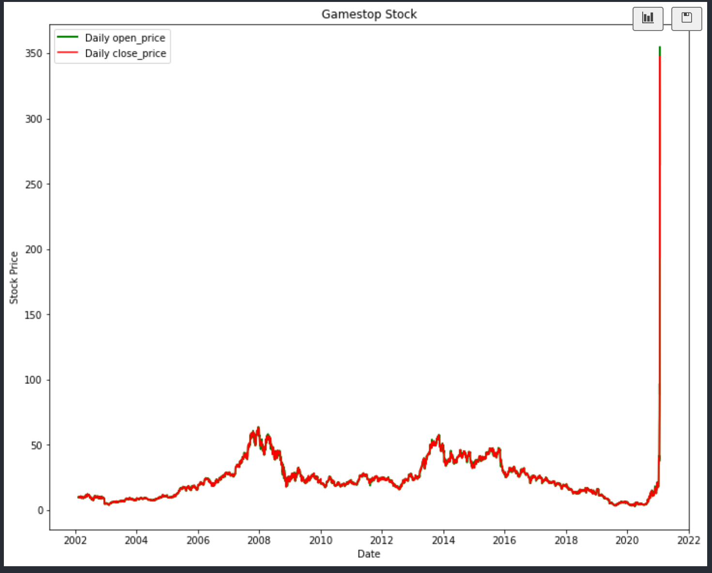

# (a & b) What type of population is being sampled? What are the "things" getting measured - usually one per row of data.

The type of information being sampled in this population is the stock prices for the stock GME (gamestop) from the years 2002 until 2021. The things getting measured are as follows.

Features:

- date
- open_price
- high_price
- low_price
- close_price
- volume
- adjclose_price

# (c) Are the features quantitative or qualtitative? Ordinal or nominal? Continous or discrete?

- Date: Qualitative, Nominal, Discrete
- Open_Price: Quantitative, Ordinal, Discrete
- High_Price: Quantitative, Ordinal, Discrete
- Low_Price: Quantitative, Ordinal, Discrete
- Close_Price: Quantitative, Ordinal, Discrete
- Volume: Quantitative, Ordinal, Discrete
- AdjClose_Price: Quantitative, Ordinal, Discrete

# (d) Is the data "complete" or do some of the samples have null or absent values for certain features? Why are these samples still useful? Why are they incomplete?

- This data set is complete and has no null values for any of the features stated above.

# (e) Why are these features chosen to be part of the dataset?

- I think all of these features are chosen to be part of the dataset so that we can analyze the trends of the GME stock over the past ~20 years. These prices for stocks are important so that we can see what happened with the stock when the "random" short squeeze happened in the early 2020s.

# (f) What are some other features that are no included but that you think might make sense to include for this dataset?

- I think a feature that is not included in this dataset but might make sense to include would be the state in which the person that bought the GME stock lives in. This would allow me to see trends between which coast or area of the United States most of the people who bought the stock live in and we can make some inferences based off of that information.

# (g) Give at least one way that you can pivot the datset to get a slightly different representation of some values. Explain what this is and how you would use it for a visualization?

- I could pivot the dataset to form a line graph that would represent a time period for the price of GME stock from the years 2015-2021. I could group the entire dataset by the open_price and close_price all over the index of date. This dataset is very large so I will only use the data from the years 2015-2021.

# (h) Identify any possible relationships between features included in the data: which ones are likely to affect others?

- We can analyze the open_price and close_price as well as the high_price and low_price during a certain time period. This short squeeze happened in January of 2021 and I want to hone in on this time period when analyzing the relationship between the time period and the stock price.

i. 

ii. We can use the ratio between time and the number of stocks being traded to analyze a trend in early 2021. This happened because of a short squeeze that many big shareholders had a great deal of liquidity in GME stock and they were slowly trying to remove their stock from the liquidity pool and it took a very long time for this GME stock price to come back down.

iii. Yes, there are many external inferences that can be made from this data. We see a big shoot up in the price of the GME stock in January of 2021, why was this? Well the data doesn't exactly scream out a reason as to why this happened so we must look deeper into what was happening during the time period to make this stock price increase so much. We know that COVID-19 was in full effect during this time and many people were working from home and had a lot of time on their hand. Many people were trying to get into stock trading for the first time in their life so not only did the price of GME get affected, but in general, the number of people trading stocks increased during this time as more people had more time to research stocks and trade due to the modality of work during COVID-19. We must also analyze how people figured out about this information about the GME stock, so we can make an inference that social media and news networks made this more public and got more eyes on the situation, in-turn more people would start to try and get into GME stock during this time in order to try and make profit. I don't think we can hypothesize a relationship with the data as we do not have any hint at social media or COVID-19 being prominent in the data, therefore we cannot make that concrete relationship, we can only speculate about these things.

# What “extra” features can you perhaps compute from the data? For example, if you have data that includes product dates of purchase, you can “engineer” the data to construct the most popular products over various lengths of time (e.g. a particular holiday season). How might you use this information? Using the holiday example, you might try to correlate holiday sales of a product to some mainstream event that popularized it.

The "extra" features I would request for this dataset would be the number of new traders who purchased the GME stock in early 2021. I would construct the most popular stocks during the time of early 2021 and analyze which stock had the most purchases by new traders. I can assume that GME would be one of the most popular stocks for new traders during this time as social media and news outlets made it known what was happening to the GME stock during this time and this encouraged many people on those platforms to start looking into stocks and GME and eventually casuing them to start to purchase these stocks as well.
