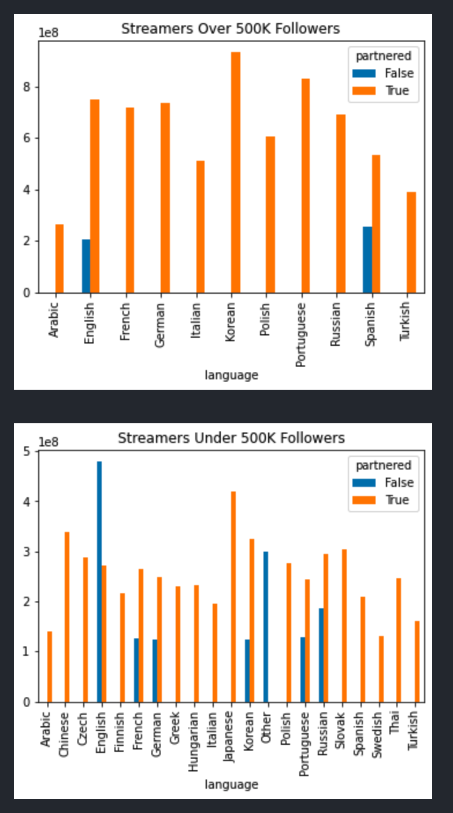

# (a & b) What type of population is being sampled? What are the "things" getting measured - usually one per row of data.

- The population being sampled are streamers on Twitch.tv. Twitch.tv is a livestreaming platform where creators can go and livestream themselves doing whatever they want. This usually includes gaming, watching sports, coding, or anything they would like to share with other people live.

- The things getting measured are
  - Channel Name
  - Watch Time (minutes)
  - Stream Time (minutes)
  - Peak Viewers
  - Average Viewers
  - Followers
  - Followers Gained
  - Views Gained
  - Partnered
  - Mature
  - Language

# (c) Are the features quantitative or qualtitative? Ordinal or nominal? Continous or discrete?

- Channel Name: Qualitative, Nominal, Discrete
- Watch Time: Quantitative, Ordinal, Discrete
- Stream Time: Quantitative, Ordinal, Discrete
- Peak Viewers: Quantitative, Ordinal, Discrete
- Average Viewers: Quantitative, Ordinal, Discrete
- Followers: Quantitative, Ordinal, Discrete
- Followers Gained: Quantitative, Ordinal, Continous
- Views Gained: Quantitative, Ordinal, Continous
- Partnered: Qualitative, Nominal, Discrete
- Mature: Qualitative, Nominal, Discrete
- Language: Qualtitative, Nominal, Discrete

# (d) Is the data "complete" or do some of the samples have null or absent values for certain features? Why are these samples still useful? Why are they incomplete?

- Yes, the data is complete and there are no null values

# (e) Why are these features chosen to be part of the dataset?

- I think these features are important to make up the dataset as these are the statistics we can analyze when we are looking at twitch streamers. These are the most important features when it comes to talking about a streamer, we want to know their follower count, subscription count, time they streamed, etc. These are all included in this dataset.

# (f) What are some other features that are no included but that you think might make sense to include for this dataset?

- I think subscription count would be a great thing to have in this dataset as we can get a sense of how much these streamers are making in terms of monitary value. Also I would like to have a donation count and an amount they've made in donations. I think salary transparency is important and this dataset does not contain anything that about the amount of money that they make. Streamers tend to make quite a bit of money off of donations, subscriptions, and sponsors. So I would like to see some of the things about the money they make although that might not be feasible and sensitive information.

# (g) Give at least one way that you can pivot the datset to get a slightly different representation of some values. Explain what this is and how you would use it for a visualization?

- I could pivot the data to form a bar chart for the language a streamer speaks grouped by watch_time and number of followers. I will analyze the language a streamer speaks and compare that with the number of followers they have and whether they are partnered by Twitch or not to see the language the most popular streamers speak.

# (h) Identify any possible relationships between features included in the data: which ones are likely to affect others?

I think the first step is to see if the language a streamer speaks affects their follower counts, watch time, partnership, and peak viewers. If they do have these attributes higher than other streamers that speak a different language we cannot prove this to be true but we can make some assumptions.

i. 

ii. We can measure the viewers gained and followers gained ratio to see if the streamers growth is proportional to the language they speak by comparing the same thing to streamers that speak a different language.

iii. Yes, they are many external inferences we can make. Like the amount of people who watch Twitch in the United States vs. other countries and the languages they speak. The viewer base plays a big part of this dataset and viewers would much rather watch a streamer that speaks their language than one that does not. So can we assume that if lets say Spanish has a higher successful streamer count, that the Spanish viewer base on Twitch is higher? These are things we must consider in what makes a streamer successful and their growth to accelerate, this relys a great deal on the type of people that watch them, so we can infer that if the language that has the most successful streamers, must have the largest viewerbase on Twitch as well.

# What “extra” features can you perhaps compute from the data? For example, if you have data that includes product dates of purchase, you can “engineer” the data to construct the most popular products over various lengths of time (e.g. a particular holiday season). How might you use this information? Using the holiday example, you might try to correlate holiday sales of a product to some mainstream event that popularized it.

I could possibly compute the "most popular" streamer at a given time based off the fact that I have the viewers gained and followers gained. I am not sure when this time period was when the data was taken but we can analyze how many followers and viewers each streamer gained during the time this data was taken and see which streamer grew the fastest.
