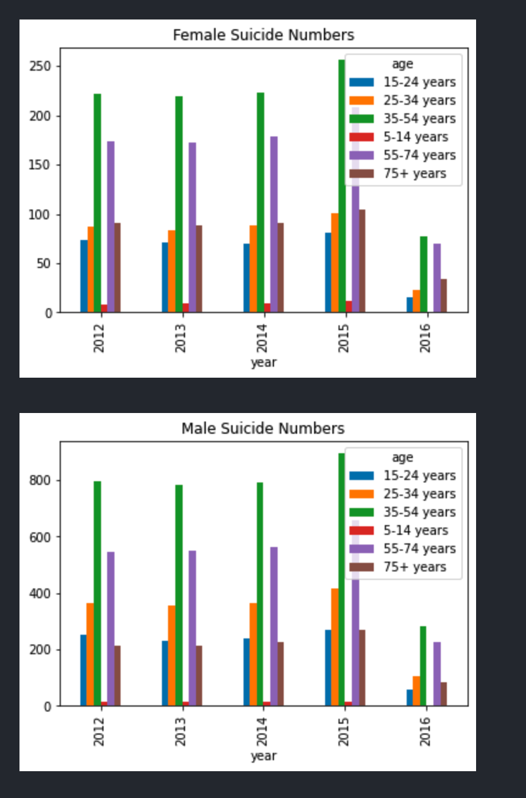
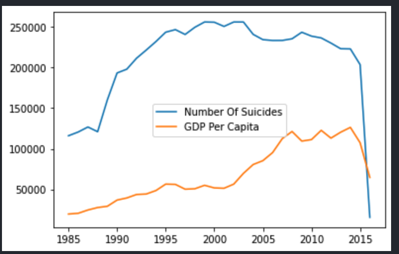

# (a & b) What type of population is being sampled? What are the “things” getting measured – usually one per row of data. What features does each sample have, i.e. what is being measured?

This dataset contains information about the suicide rate per country. The time period that this dataset contains is from 1987 to 2016. Countries are being sampled by years. Each row has a country, year, gender, age. These are all large data groups.

Each country has a corresponding year.
Features:

- Gender
- Age Group
- Number of Suicides
- Population Size
- Suicides Per 100k Population
- Human Development Index / Year
- GPD
- GPD per Capita
- Generation

# (c) Are the features quantitative or qualitative? Ordinal or nominal? Continuous or discrete?

- Almost all of the features are quantitative with the exception of a few.
  Quantitative:
- Population
- Suicides Per 100k Population
- GPD

Qualitative:

- Generation
- Gender

Gender and age groups are nominal features of every sample. HDI (human development index) is ordinal.

Almost all features are discrete except the HDI and Suicides Per 100k Population

# (d) Is the data “complete” or do some of the samples have null or absent values for certain features? Why are these samples still useful? Why are they incomplete?

- This dataset is incomplete. Some countries have null HDI values. This is probably because the HDI for that country was not measured for a specific year for some unknown reason. These null samples are still useful to use as if we do a calculation that does not involve HDI, it will not affect us at all. However, this can be bad for cases where we require the analysis of the HDI and we cannot do that with null values.

# (e) Why are these features chosen to be part of the dataset?

These features can be measured and used in order to make correlations, predictions, calculations, etc.

# (f) What are some other features that are not included but that you think might make sense to include for this dataset?

- I think these features are part of the dataset because it gives the analyst a sense of background information about the people who took their lives during a certain year and the factors that played into that tragic event. These statistics are calculated and taken in order to prevent more lives from being taken so although some of the data features may seem like they are not needed or do not apply, they most likely do in some fashion we may not see as researchers study this material in order to find ways to bring the number of suicides down each year.

- I think some extra features that could be included are the use of social media of these people who took their lives. I believe that social media plays a major role in people become depressed and having the desire to kill themselves. I would also like to know which social media platform they used if any to see exactly which platform had the most suicides attributed to it. I would also like a data feature to see if these people had any underlying health issue whether that be a life threatening illness, adhd, depression, etc. These things can all factor into the reasons why a person may take their life and I feel they could be valuable to this dataset.

# (g) Give at least one way that you can pivot the dataset to get a slightly different representation of some values. Explain what this is and how you would use it for a visualization.

I could pivot the data to create a time period for a country and group the entire dataset by country, gender, age, all over the index of time. However, this data set is VERY large so I will use the time period of 2012-2016.

# (h) Identify any possible relationships between features included in the data: which ones are likely to affect others?

We can analyze the suicide rate pertaining to the GPD of country that these suicides are happening in. It can be presumed that "poorer" countries have more suicides but is that true? We can see if "richer" or "poorer" countries have a higher suicide rate. We want to see if gender and age group have any relationship to people taking their own lives.
For the example below, we can create a timeline of the years for all the countries in the dataset to see if the suicide rates have increased over the years, and compare it to the GDP Per Capita of those countries.

i. 

ii. We can measure the ratio between population to see if the growth of a population is proportional to the suicide counts in that country. If a country grows more, does the suicide rate go up? If not, then what is causing it? Naturally, that should be the case but it is unknown.

iii. I think an inference can be made about the age of the internet and social media that we are in. Now that the internet is at it's "peak" and almost everyone uses the internet on a daily basis, some people's identity only exist on the internet. The suicide rates skyrocketed now that the internet is at it's all time high as well. So I think there is a correlation to be made there.

Another possible correlation that can be inferred is that the stock market crash of 2008, many people became very depressed and lost their job and are still trying to recover in the mid 2010s and this dataset and image show the dip in GDP per capita around the 2000-2005 area and this is around the time of 9/11 and the stock market crash.

# What “extra” features can you perhaps compute from the data? For example, if you have data that includes product dates of purchase, you can “engineer” the data to construct the most popular products over various lengths of time (e.g. a particular holiday season). How might you use this information? Using the holiday example, you might try to correlate holiday sales of a product to some mainstream event that popularized it.

An "extra" feature that I think would be beneficial in computation would be the percentage of suicides per gender. If I have the percentage of suicides per gender, we can do more calculations with that and make more inferences with that data.
